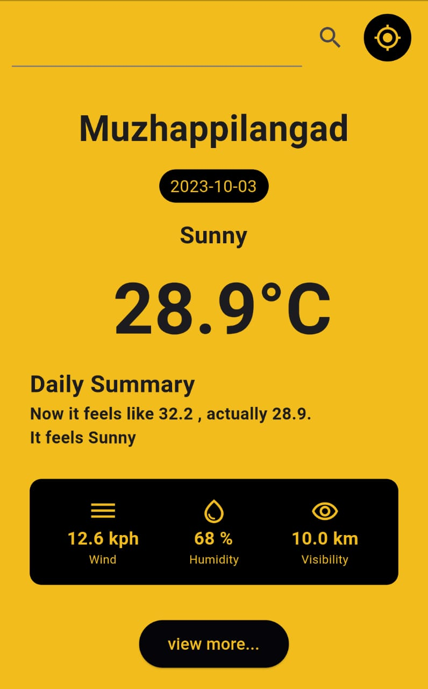
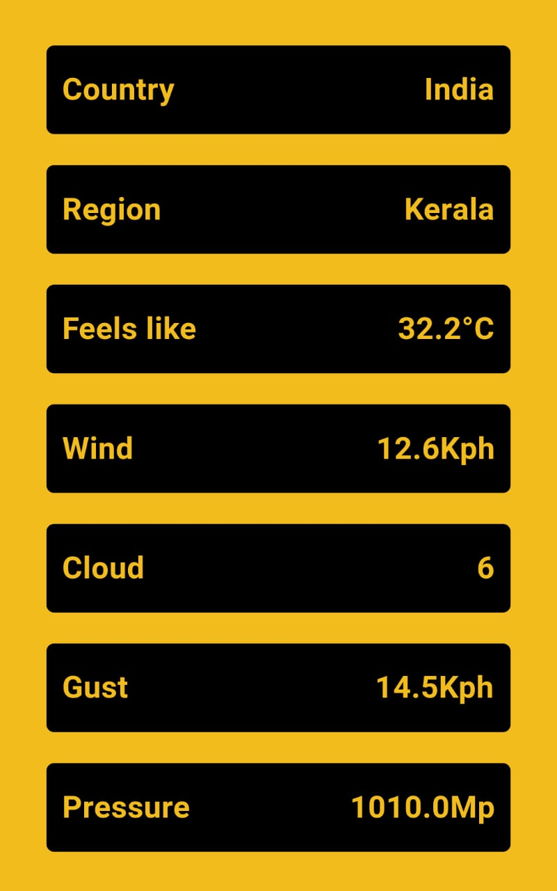

# Weather App

Welcome to the Flutter Weather App project! This is a beautiful and user-friendly weather application built using the Flutter framework, providing real-time weather data sourced from a REST API. 

- **Beautiful UI**: The app boasts an attractive and user-friendly user interface to provide an exceptional user experience.
- **Real-time Weather Data**: It fetches weather data from a REST API, ensuring up-to-date and accurate weather information.
- **Location-based Weather**: The app uses the device's location to display weather information for the user's current location by default. Users can also search for weather in other locations.
- **Detailed Weather Information**: Get detailed weather data including temperature, humidity, wind speed, and more.

## Screenshots

   &nbsp;
  

